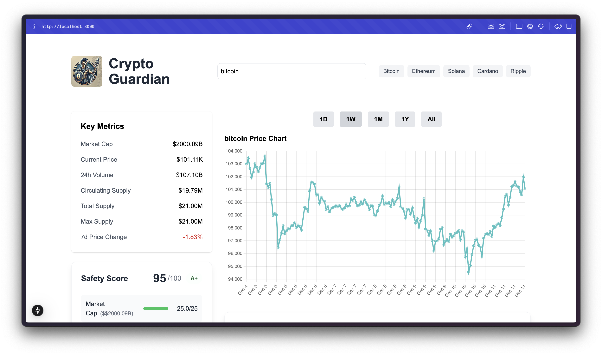

# Crypto Guardian

## Screenshots

### Graph & Key Metrics


### Safety Score & Breakdown


## Table of Contents
- [Overview](#overview)
- [Features](#features)
- [Technologies Used](#technologies-used)
- [Installation](#installation)
- [Usage](#usage)
- [API Integration](#api-integration)
- [Contributing](#contributing)
- [License](#license)

## Overview
Crypto Guardian is a web-based tool that allows users to visualize the price trends of various cryptocurrencies while assessing their safety and potential for rug pulls. Users can input a cryptocurrency, view its price graph, and analyze key metrics to make informed investment decisions.

## Features
- **User Input**: Users can input a cryptocurrency to display its price graph.
- **Dynamic Timeframes**: Choose between 1D, 1W, 1M, 1Y, and All-time to view price trends.
- **Key Metrics**: Display essential metrics such as market cap, liquidity, and 7-day price trend.
- **Safety Score**: Calculate a safety score based on various metrics, including:
  - Token vesting schedules: Check for locked tokens and distribution patterns.
  - Liquidity metrics: Look for locked liquidity pools.
  - Volume trends: Sudden high volumes often indicate manipulation.
  - Developer activity: Analyze GitHub commits or public updates.
- **Predictive Metrics**: Implement predictive models in Python and serve predictions via Flask, including:
  - Linear Regression: Simple trend analysis.
  - LSTM (Long Short-Term Memory): Better for time-series prediction.
  - ARIMA (Auto-Regressive Integrated Moving Average): Focus on statistical analysis.
- **Graphical Predictions**: Display results on a graph in green based on the previous range and future range, allowing users to visualize potential future trends.

## Technologies Used
- **Frontend**: 
  - React
  - Next.js
  - Tailwind CSS
- **Backend**: 
  - Node.js for API logic
  - Flask for serving predictive models
- **API**: 
  - CoinGecko API for cryptocurrency data
- **Machine Learning**: 
  - Python for predictive metrics (LSTM, ARIMA, Prophet, GRU, Time Series Transformer)

## Installation
To run this project locally, follow these steps:

1. Clone the repository:
   ```bash
   git clone https://github.com/yourusername/crypto-guardian.git
   cd crypto-guardian
   ```

2. Install the dependencies:
   ```bash
   npm install
   ```

3. Start the development server:
   ```bash
   npm run dev
   ```

4. Open your browser and navigate to `http://localhost:3000`.

## Usage
- Use the search bar at the top to find a cryptocurrency.
- Click on any of the common coins displayed below the search bar for quick access.
- Select a timeframe to view the price graph.
- Key metrics will be displayed on the left side of the graph.
- Click on the safety score to see detailed metrics and explanations.

## API Integration
This application integrates with the CoinGecko API to fetch real-time cryptocurrency data. The API endpoints used include:
- `/coins/{id}/market_chart?vs_currency=usd&days={days}`: Fetches market chart data for a specific coin.
- `/coins/{id}`: Fetches detailed information about a specific coin.

## Contributing
Contributions are welcome! If you have suggestions for improvements or features, please fork the repository and submit a pull request.

## License
This project is licensed under the MIT License. See the [LICENSE](LICENSE) file for details.

---

Feel free to reach out if you have any questions or need further assistance!
